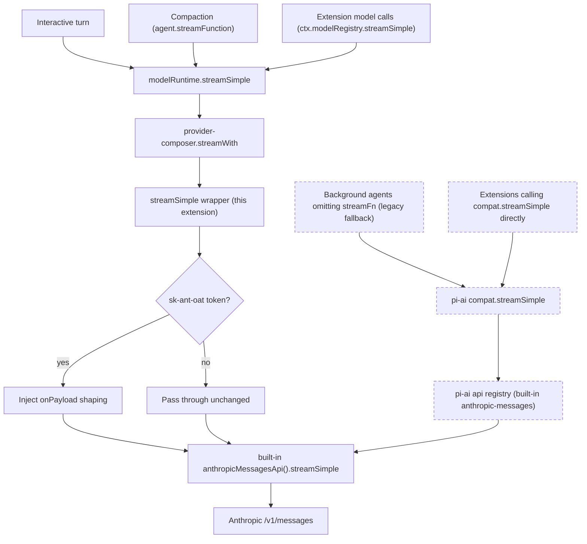

# Architecture

This document explains how `pi-anthropic-auth` applies Anthropic Claude Pro/Max OAuth compatibility shaping, and why it does so at Pi's transport layer rather than through an event hook.

## Overview

The extension re-registers Pi's built-in `anthropic` provider with a thin `streamSimple` transport wrapper that shapes outgoing OAuth requests.
Login and refresh are delegated to Pi's built-in `anthropicOAuth` (the extension omits `oauth`, and `composeModelProvider` falls back to the built-in auth).

The wrapper is the single shaping point.
It delegates to Pi's own built-in Anthropic `streamSimple` transport and only injects an `onPayload` step, so it does not reimplement Pi's Anthropic transport.

## The problem: a hook-coverage gap

Earlier versions shaped requests in a `before_provider_request` handler.
That hook is threaded into the interactive agent loop's `streamFn` only.

Auxiliary Anthropic OAuth calls bypass it:

- Pi's built-in compaction/summarization issues `completeSimple` without an `onPayload`.
- Third-party background agents (for example pi-observational-memory's observer, reflector, and dropper) ran via `agentLoop`, which then defaulted to pi-ai's bare `streamSimple`.

Those requests reached Anthropic carrying an OAuth token but no Claude Code billing header.
Anthropic then classified them as third-party app usage and returned the misleading `You're out of extra usage.` HTTP 400 reported in Issue #18 with `pi-fork` and `pi-observational-memory`.

The transport wrapper closed the compaction half of that gap and, on pi <=0.80.7, the background-agent half as well.
pi 0.80.8 reopened the background-agent half for callers that dispatch through pi-ai's `compat.streamSimple`.
pi 0.86.0 then gave extensions a supported path that reaches the wrapper, `ctx.modelRegistry.streamSimple()`, and pi-observational-memory 3.1.x uses it.
See "The remaining gap: pi-ai compat dispatch" and "Supported path for extension authors" below.

## The seam: a `streamSimple` transport wrapper

Pi's `registerProvider({ api, streamSimple })` stores the config in pi's own `extensionProviders` map.
`provider-composer.ts`'s `streamWith` then applies it whenever a request arrives through `modelRuntime`:

```ts
if (extension?.streamSimple && model.api === extension.api) {
  return extension.streamSimple(model, context, options as SimpleStreamOptions);
}
```

Both the interactive loop and compaction dispatch through `modelRuntime`, so both reach the wrapper.
`sdk.ts`'s `createAgentSession` supplies `streamFn: (model, context, options) => modelRuntime.streamSimple(...)`, and `agent-session.ts` reuses that same `agent.streamFunction` at both compaction call sites.
Extension model calls issued through `ctx.modelRegistry.streamSimple()` (pi >=0.86.0) reach it too: `ModelRegistry.streamSimple` delegates to `ModelRuntime.streamSimple`, which dispatches to the composed provider.

Callers that dispatch through pi-ai's own `compat.streamSimple` do not reach the wrapper at all:



The dashed lane is unshaped: it reaches the same built-in transport, but without the billing header.

The wrapper delegates to Pi's built-in Anthropic `streamSimple` transport, resolved at runtime by `src/host-transport.ts` rather than read out of the API registry.
`anthropicMessagesApi()` is the direct, non-deprecated handle pi's own `custom-provider-gitlab-duo` example delegates through, and reading from a registry this extension does not participate in would bind the delegate to whatever another extension registered there last.
On pi <=0.80.7 the rationale was stronger still: `registerProvider` wrote our wrapper into that registry, so reading the delegate back out of it would have recursed.
The related Issue #28 lazy-registration clobber is precluded by the `>=0.86.0` peer floor.
The resolver imports `@earendil-works/pi-ai/compat` — the subpath pi's own `custom-provider-gitlab-duo` example delegates through — and reads the non-deprecated `anthropicMessagesApi().streamSimple` factory, throwing when that handle is absent.
It consults no other handle: the factory has shipped from the compat entrypoint since pi v0.80.0, below the `>=0.86.0` peer floor, so the former fallback to the deprecated `streamSimpleAnthropic` alias could not be reached by any supported host and was removed (Issue #54).
On pi >=0.80.8 the host loader aliases (Node) / virtualizes (Bun) both the bare `@earendil-works/pi-ai` specifier and the `/compat` subpath to its bundled compat entrypoint (`dist/compat.js`); the subpath names the surface we actually depend on.
A loader-aliased specifier is required because `import.meta.resolve` and non-aliased subpath imports bypass that host indirection: jiti consults its `alias`/`virtualModules` maps on the import path but not on the `resolve` path, so the former `import.meta.resolve("@earendil-works/pi-ai")` plus derived `dist/...` file import fell through to filesystem resolution from the extension's own directory and failed when pi-ai was absent from it — the `pi install` and Bun-binary cases (Issue #31).
The #35 seam concern is resolved in practice: the loader aliases `/compat` in both modes and pi ships this delegation pattern as an official example.
The residual watch is the eventual `compat` removal, at which point `anthropicMessagesApi()` relocates off the compat entrypoint (Issue #35).

## Provider-name scope

`streamWith` looks the extension config up by the request's **provider**, not its api.
In order, it uses the extension's `streamSimple` when one is registered for that provider, then a built-in base provider that supports the api, and finally pi-ai's bare `getApiProvider(model.api)` transport.
So the wrapper covers exactly the provider names this extension registers, and `anthropic` is only the default one.

An Anthropic OAuth subscription another extension registers under its own name falls through to the last branch.
[pi-multi-pass](https://github.com/hjanuschka/pi-multi-pass) registers `anthropic-2`, `anthropic-3`, and so on, with `api: "anthropic-messages"`, `oauth`, and `models`, but no `streamSimple`, and those names have no built-in base.
The bare transport sends the Claude Code user-agent, `x-app: cli`, the OAuth betas, and the identity block, but no billing header, and Anthropic rejects a real agent prompt with the misleading `You're out of extra usage.` 400 (Issue #70).
The reporter measured the deciding factor on 2026-09-21 (pi 0.86.1, `claude-opus-5`, a 28 KB prompt from a failing session):

| request | result |
| --- | --- |
| pi prompt, no billing header | 400 `You're out of extra usage.` |
| same prompt, billing header prepended | 200 |
| preamble sanitized, still no billing header | 400 |
| minimal prompt, billing header prepended | 200 |

Short prompts pass without the header, so a trivial repro is a false green.
Reproduced live on 2026-09-24 (pi 0.87.1, `claude-haiku-4-5`, this repository's prompt, `anthropic-2` a second login of the same account): 400 without the config, 200 with it.

The user names those providers in the extension's config file, `{ "providers": ["anthropic-2"] }`, and each is registered with the same wrapper instance as `anthropic`, so they share one learned Claude Code floor.
The global file (`<agentDir>/extensions/pi-anthropic-auth/config.json`) is applied when the extension loads; the project file (`<cwd>/.pi/extensions/pi-anthropic-auth/config.json`) is applied at `session_start`, and only when `ctx.isProjectTrusted()`.
That is early enough: `session_start` is awaited before the first prompt, and `ModelRuntime.streamSimple` looks the provider up per request.
Explicit naming was chosen over auto-detection through `ModelRegistry.getRegisteredProviderIds()`, which would need an event-time scan and a check that spares providers with a built-in base such as `cloudflare-ai-gateway`.

A named provider is registered but never unregistered first, unlike `anthropic` (Issue #43): it belongs to the other extension, and `unregisterProvider` would drop that owner's `models` and `oauth`.
`ModelRuntime.registerProvider` merges defined keys over the previous registration, which makes the bare `{ api, streamSimple }` safe in either load order.
When the owner registers first, only those two keys change.
When we register first, the provider records a transient `no authentication method configured` composition error until the owner's registration merges `oauth` in; a name no extension ever registers keeps that error, which pi surfaces through `modelRegistry.getError()`.
The same merge means a registered `streamSimple` can never be cleared again, so the two config layers only ever add providers, and one removed from a file stays shaped until `/reload`.

Delegation stays behavior-preserving for requests the token gate passes through: a named provider without its own `streamSimple` or a built-in base already ran on the bare transport the wrapper delegates to.

## OAuth gating

Shaping is gated on the resolved API key, available to the transport as `options.apiKey`.
Anthropic OAuth access tokens carry an `sk-ant-oat` prefix, which is the same signal Pi's built-in provider uses internally to decide whether to emit Claude Code identity headers.

When the token is not an Anthropic OAuth token, the payload passes through untouched.
This replaces the previous, brittle approach of sniffing system-prompt markers and keeps API-key and non-Anthropic requests on Pi's normal path.

## What the wrapper does

For OAuth requests, the injected `onPayload` runs `shapeAnthropicOAuthPayload`, which:

1. sanitizes Pi's default prompt section by section (de-fingerprinting) — replacing the untagged preamble with a minimal neutral prompt, dropping the `docs` section, and stripping the custom-tool filler from inside `tools`, while preserving every other section byte-identically,
2. applies those same section rules to the mid-conversation `role: "system"` messages Pi 0.86.0 re-sends on models that accept them (Issue #69) — a message the rules empty is dropped unless it carries `output_config`, because on managed-effort models (Fable 5.1, Opus 5, Opus 5.5) Pi pins the top-level effort to `"high"` and sends the requested effort as content-less system messages, which dropping would silently discard (PR #79), and
3. prepends an `x-anthropic-billing-header` system block (without `cache_control`).

Assistant messages pass through unmodified; see "Assistant block ordering is not normalized" below.

For OAuth requests the wrapper also injects an `options.fetch` wrapper.
One fact it needs is not available at `onPayload` time: pi-ai's `createClient` adds `user-agent: claude-cli/<version>` to the built request, downstream of every other seam this extension can reach, and Anthropic gates new models on the `cc_version` we send rather than on that header.
The bundled pin is therefore a floor — when pi reports a higher Claude Code version, the fetch wrapper rebuilds the billing header at pi's version and splices it into the outgoing body; otherwise the body is sent exactly as `onPayload` produced it.
The splice is an exact-string replacement of the header this extension emitted moments earlier, never a JSON round-trip, so the byte-exact section preservation above survives it.
An explicit `PI_ANTHROPIC_AUTH_CLAUDE_CODE_VERSION` override is absolute and is never raised (Issue #74).

The same `fetch` wrapper recovers when Anthropic raises a model's floor above both pi and the pin (Issue #75).
It inspects only a 400, through `response.clone()`, so a streaming success response is never read.
When the body is a `claude_code_version_too_old` rejection naming a higher floor, the wrapper splices the billing header up to that floor and retries once, with the same exact-string replacement as above.
The floor is learned for the wrapper's lifetime, owned by `createAnthropicOAuthStreamSimple` rather than by module state, so later requests go out at it directly.
When recovery cannot run (an override is set, the floor is not named, the body cannot be rebuilt) or the retry is rejected too, the 400 is returned with a `[pi-anthropic-auth]` hint appended to `error.message`; status, headers, `error_code`, and `request_id` are preserved.

The wrapper composes, rather than replaces, any caller-provided `onPayload` and any caller-provided `fetch`.
On the main loop, Pi still passes its own `onPayload` (which fires other extensions' `before_provider_request` handlers); the wrapper runs those first and applies our shaping last, closest to the wire.

## Assistant block ordering is not normalized

Until Issue #66 this extension split any assistant turn that carried a non-`tool_use` block after a `tool_use` block into two consecutive assistant messages.
That behavior was ported from OpenCode on the strength of a source comment describing Anthropic as rejecting `[tool_call, tool_call, text]`, and was never tested against Anthropic from this repository.

It was measured on 2026-09-20, sending assistant histories over a Claude Max OAuth token with the Claude Code OAuth headers Pi sends (`anthropic-beta: claude-code-20250219,oauth-2025-04-20`, `user-agent: claude-cli/<version>`, `x-app: cli`) and matching `tool_result` blocks:

| assistant history shape | sonnet-4-5 | haiku-4-5 | sonnet-5 | fable-5 | opus-4-8 |
| --- | --- | --- | --- | --- | --- |
| `[tool_use, tool_use, text]` | 200 | 200 | 200 | 200 | 200 |
| `[text, tool_use, text, tool_use]` | 200 | 200 | 200 | 200 | 200 |
| `[text]` + `[tool_use, tool_use]` (the old shaped output) | 200 | 200 | 200 | 200 | 200 |

Anthropic accepts trailing text after `tool_use`, so the split prevented a rejection that does not occur.
Meanwhile it actively broke interleaved thinking: Pi serializes such a turn as `[thinking, tool_use, thinking, tool_use]`, and hoisting the signed `thinking` blocks out reordered them relative to the content they were produced against, which Anthropic rejects with `thinking … blocks in the latest assistant message cannot be modified`.

The helper is gone.
Do not reintroduce ordering normalization without a fresh live rejection to point at — `test/pi-anthropic-ordering-experiment.test.ts` pins both Pi's serialization and our passthrough.

## Call paths covered

| Call path | Issued by | Reaches `before_provider_request` | Reaches the wrapper |
| --- | --- | --- | --- |
| Interactive turn | agent loop `streamFn`, into `modelRuntime` | yes | yes |
| Compaction / summarization | `agent.streamFunction`, into `modelRuntime` | no | yes |
| Extension model calls and background agents using `ctx.modelRegistry.streamSimple()` | a third-party extension (pi >=0.86.0), into `modelRuntime` | no | yes |
| Explicit `compat.streamSimple` callers | a third-party extension | no | no |
| Background agents omitting `streamFn` | an untyped or pre-0.81 extension, into the `setDefaultStreamFn` fallback (`compat.streamSimple`) | no | no |
| Fork children | a separate `pi` process | per-process | for that process's own `modelRuntime` traffic |

## The remaining gap: pi-ai compat dispatch

pi's SDK still hands pi-ai's `compat.streamSimple` to callers that supply no stream function of their own:

```ts
// packages/coding-agent/src/core/sdk.ts
// Preserve the pre-0.81 fallback for extensions that construct Agent instances
// or invoke low-level agent loops without supplying streamFn.
setDefaultStreamFn(streamSimple);
```

That default resolves the transport from pi-ai's api registry, which still holds the built-in Anthropic transport.
Up to pi 0.80.7, `ModelRegistry.applyProviderConfig` bridged an extension's `streamSimple` into that registry via `registerApiProvider`, so those calls reached the wrapper too.
pi 0.80.8 replaced `ModelRegistry` with `ModelRuntime` and dropped the bridge; no file in `pi-coding-agent`'s `dist/` has called `registerApiProvider` since.
Because this package's peer floor is well above 0.80.8, the bridge is absent on every host version this extension supports.

The fallback is a legacy path rather than a supported seam.
pi-agent-core 0.81.0 made `streamFn` required in the public types of `Agent` and the loop functions, and 0.81.1 restored the fallback at runtime only, for untyped and pre-0.81 extensions.
`getDefaultStreamFn` is not exported, only `setDefaultStreamFn`.

So the lane is reached two ways: by extensions that pass `compat.streamSimple` explicitly, and by callers that omit `streamFn` and land on this fallback.
Extensions that pass `ctx.modelRegistry.streamSimple` instead are covered; see "Supported path for extension authors" below.

An Anthropic OAuth request on that lane carries no Claude Code billing header and comes back as `You're out of extra usage.` — a billing message for what is really a coverage gap.

### Why this extension does not close it

The obvious fix is to call `registerApiProvider` ourselves.
It would work mechanically: `compat`'s built-in fast path is guarded by an identity check against the registry, so any override makes the check fail and dispatch falls through to us.

It is not done because the registry is keyed by **api**, not by provider, and `registerApiProvider` is a `Map.set`.
There is one `anthropic-messages` slot, shared by ten built-in providers: `anthropic`, `cloudflare-ai-gateway`, `fireworks`, `github-copilot`, `kimi-coding`, `minimax`, `minimax-cn`, `opencode`, `opencode-go`, and `vercel-ai-gateway`.
Registering an override unconditionally diverts all ten off the built-in provider branch on the compat lane:

| Case | Built-in branch calls | An override would call | Delta |
| --- | --- | --- | --- |
| `anthropic` with `sk-ant-oat` | `anthropicMessagesApi()` | shaped, then `anthropicMessagesApi()` | the intended fix |
| `anthropic` with an API key | `anthropicMessagesApi()` | gate fails, then `anthropicMessagesApi()` | none |
| the eight bare-api providers | `anthropicMessagesApi()` | gate fails, then `anthropicMessagesApi()` | none |
| `cloudflare-ai-gateway` | `cloudflareStreams(anthropicMessagesApi())` | `anthropicMessagesApi()` | broken |

The middle two rows are exact rather than approximate: `createProvider`'s dispatch resolves to the same bare `anthropicMessagesApi()` streams, and `compat` applies `withEnvApiKey` identically in both branches.

The last row is a real regression inflicted on an unrelated provider.
`cloudflareStreams` substitutes `{CLOUDFLARE_ACCOUNT_ID}` and `{CLOUDFLARE_GATEWAY_ID}` into `model.baseUrl`; skipping it sends requests to a literal-placeholder URL.
That wrapping lives at the **provider** layer, which an api-registry entry structurally cannot see.
When Issue #46 was decided it also could not be reconstructed from the public surface: `builtinModels` is not exported from `@earendil-works/pi-ai/compat`, and `getProviders()` returns provider id strings rather than `Provider` objects.
pi 0.81.0's `ModelRegistry.getProvider()` removed that obstacle but not the objection; see "Re-examined for pi 0.81 through 0.87" below.

This extension exists to interface with an Anthropic subscription.
Anthropic API-key traffic and every other provider must be unaffected by it, and a global api-registry write cannot honor that: it is exact for nine of ten providers, and exact for the tenth only by re-implementing compat's own dispatch.
So the gap is documented rather than closed.

`test/index-registration.test.ts` pins this boundary — registering the extension must leave the built-in `anthropic-messages` registry entry identical.

Upstream relief is not pending either.
[pi#6089](https://github.com/earendil-works/pi/issues/6089), which asked for a provider-bound payload transform applied at pi-ai's dispatch layer, was auto-closed as not planned and never reopened.

### Re-examined for pi 0.81 through 0.87

Issue #53 re-opened the decision when pi 0.81.0 added `ModelRegistry.getProvider()`, and swept every release through 0.87.1 for a better seam.
The answers below were read from the pi source at v0.86.0 (this package's peer floor) and v0.87.1, and did not change between them.

1. `modelRegistry.getProvider("cloudflare-ai-gateway")` returns the effective provider: the untouched built-in, `cloudflareStreams` included, or the `composeModelProvider` result when an overlay exists.
   The reconstruction obstacle is gone.
2. `modelRegistry` is reachable only from a handler's `ctx`, not from `ExtensionAPI` at load time, so an api-registry entry built on it would leave every request before `session_start` unshaped.
3. The compat lane passes the whole `model`, so an api-registry callee can read `model.provider`.
4. A native `Provider` registration (`ModelRuntime.registerNativeProvider`) composes into `ModelRuntime` only; nothing in `coding-agent` calls `registerApiProvider`, so it does not reach the compat lane.

A provider-aware api-registry override is therefore constructible, and still rejected.
It remains a global write to the one `anthropic-messages` slot, disabling compat's built-in fast path for all ten providers.
To stay exact it would have to re-implement compat's own branches — `withEnvApiKey`, and the `cloudflare-*` unresolved-auth branch that routes through pi-ai's private `compatModels` — and `getProvider` returns pi's *composed* provider, which differs from compat's pure built-in whenever `models.json` overlays exist.
Its remaining beneficiaries are callers that chose `compat.streamSimple` explicitly, and they have a supported alternative.

A provider-aware default stream function (`setDefaultStreamFn`) was also considered and rejected.
Without an exported `getDefaultStreamFn` it cannot chain to the previous default, so it would hard-code `compat.streamSimple` and silently replace any other installer.
It would reach only callers that omit a `streamFn` the types require, at the cost of a `@earendil-works/pi-agent-core` peer dependency.

What did change is the supported path, below.
Measured on 2026-09-24 with pi 0.87.1 and `anthropic/claude-haiku-4-5`, from a disposable extension issuing one request at `session_start` with `PI_ANTHROPIC_AUTH_DEBUG=all`:

| Probe call | Shaping debug line for the probe | `before-provider-request` lines (probe + main prompt) |
| --- | --- | --- |
| `ctx.modelRegistry.streamSimple(model, context)` | yes | 2 |
| `compat.streamSimple(model, context, { apiKey, headers })` | no | 1 |

The payload was synthetic (this repository's `AGENTS.md` as the system prompt), and both probe requests returned 200, so the status code did not discriminate here; the shaping debug line is the evidence.

### Supported path for extension authors

Since pi 0.86.0, extensions issue model calls through `ctx.modelRegistry.stream()` and `streamSimple()`, which resolve the configured provider and its authentication.
That call goes through `ModelRuntime` and `provider-composer`, so it reaches the wrapper — pass it as the stream function for background agents:

```ts
// Covered: ModelRegistry -> ModelRuntime -> provider-composer -> the wrapper.
const streamFn: StreamFn = (model, context, options) =>
  ctx.modelRegistry.streamSimple(model, context, options);
agentLoop(prompts, context, config, signal, streamFn);

// Uncovered: pi-ai's compat dispatch never reaches provider-composer.
agentLoop(prompts, context, config, signal, compat.streamSimple);
```

pi-observational-memory 3.1.x is the worked example: `resolveWorkerStreamSimple` in `src/agents/worker-stream.ts` prefers `modelRegistry.streamSimple` for its observer, reflector, and dropper, and falls back to an explicit `compat.streamSimple` only on hosts older than pi 0.86.0, below this package's peer floor.

## What stays untouched

- Non-Anthropic providers (different `api`, so the token gate short-circuits to pass-through).
- Plain Anthropic API-key requests (no `sk-ant-oat` token).
- Pi's built-in Anthropic model list (no `models` are registered).
- Pi's native `/login anthropic` flow (handled by Pi's built-in `anthropicOAuth`).

## Related files

- `src/index.ts` — resolves the built-in Anthropic transport at runtime; registers the `streamSimple` wrapper on `anthropic` and on the providers the config files name, the `session_start` handler that applies the project config, and the `/anthropic-auth:status` diagnostics command.
- `src/extension-config.ts` — the config file paths and a parser that turns malformed files and entries into warnings instead of throwing (Issue #70).
- `src/extra-provider-shaping.ts` — registers the wrapper on each named provider without unregistering it, and records the naming layer and warnings for the status command (Issue #70).
- `src/host-transport.ts` — resolves Pi's built-in Anthropic transport at runtime via an `@earendil-works/pi-ai/compat` import through Pi's loader indirection, reading the `anthropicMessagesApi()` factory (Issue #28, Issue #31, Issue #35, Issue #54); `import.meta.resolve` bypassed that indirection and failed under `pi install` / Bun.
  See `docs/builtin-transport-seam-gap.md` for why no resolution handle is both loader-safe and durable past pi-ai's `compat` removal, and the committed near-term direction.
- `src/oauth-transport.ts` — the token-gated `streamSimple` wrapper.
- `src/request-shaping.ts` — the shaping pipeline applied via `onPayload`.
- `src/anthropic-message.ts` — loose structural types for the `messages[]` entries that shaping and billing-header construction both read.
- `src/billing-header.ts` — the `x-anthropic-billing-header` recipe, with the Claude Code version as an explicit parameter so the same header can be rebuilt at a different version.
- `src/claude-code-version.ts` — the Claude Code version floor, its environment override, `claude-cli` user-agent parsing, and numeric version comparison (Issue #74), plus the floor learned from rejections (Issue #75).
- `src/billing-version-sync.ts` — the per-request `fetch` wrapper that raises `cc_version` to pi's reported version at the wire (Issue #74), and retries or hints a `claude_code_version_too_old` rejection (Issue #75).
- `src/version-rejection.ts` — parser for Anthropic's `claude_code_version_too_old` rejection body, and the wording of the hint appended when recovery cannot help (Issue #75).
- `src/system-prompt-sections.ts` — parser for Pi's XML-sectioned system prompt; splits it into ordered chunks and renders them back byte-exactly, so an unrecognized section is copied rather than re-serialized (Issue #67).
- `src/system-prompt-shaping.ts` — section-aware sanitizer that replaces Pi's preamble, drops the `docs` section, strips the `tools` filler, and preserves everything else.
- `src/diagnostics.ts` — `ExtensionDiagnostics` value object, `formatDiagnosticsReport`, and `createStatusCommandHandler`; surfaced by the `/anthropic-auth:status` command registered in `src/index.ts`.
